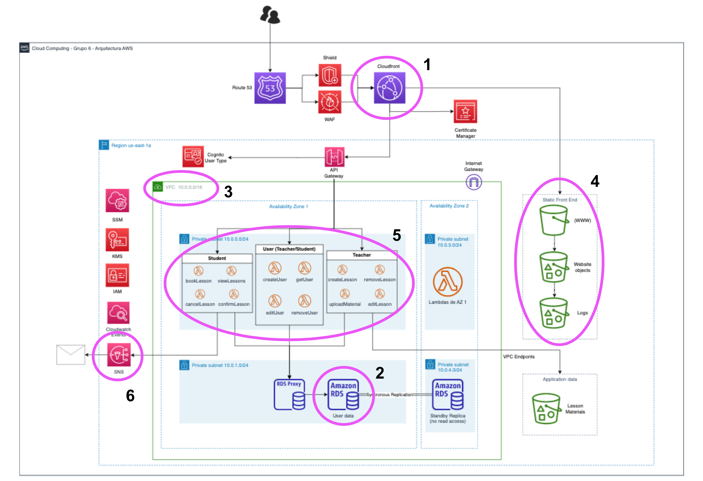

# repo-template

Repositorio correspondiente al Grupo 6:

1. **Modulos:**

   * Cloudfront (custom-made): crea una instancia de Amazon Cloudfront.
   * Lambda (custom-made): crea una instancia de una función Lambda.
   * RDS (custom-made): crea la base de datos relacional RDS.
   * SNS (externo): crea el servicio de notificaciones por email.
   * VPC (custom-made): crea las redes y subredes utilizadas para instanciar otros modulos.
   * S3 Buckets (custom-made): crea multiples buckets S3 según la arquitectura propuesta (uno estático, un intermedio y uno de logs).
   * Route 53 (custom-made): crea una instancia de Amazon Route 53.
   * ACM (custom-made): vincula un servicio de ACM al Route 53.

   ---
2. **Componentes**

   1. Cloudfront
   2. RDS
   3. VPC
   4. S3 Buckets para la website estática
   5. Lambda
   6. SNS

   ---
3. **Funciones:**

   * format:
     * ubicación: (en /organization) web-site.tf ; linea 10
     * descripción: concatena dos strings "www" y el domain_name
   * fileset:
     * ubicación: (en web-site module) main.tf ; linea 170
     * descripción: devuelve un set con todos los recursos de la carpeta /resource
   * filemd5:
     * ubicación: (en web-site module) main.tf ; linea 174
     * descripción: hashea el nombre del recurso para un etag
   * lenght:
     * ubicación: (en VPC module) main.tf ; linea 30
     * descripción: calcula la cantidad de instancias de un recursos para sumarla en un cálculo

   ---
4. **Meta-argumentos:**

   * depends_on:

     * ubicación: (en web-site module) output.tf ; linea 18
     * descripción: se activa el acl solo si se crearon los recursos dentro del depends_on
   * count:

     * ubicación: (en VPC module) main.tf ; linea 12
     * descripción: instancia la cantidad de recursos indicada en la variable asignada a count
   * for_each:

     * ubicación: (en Lambda module) main.tf ; linea 2
     * descripción: itera por una array de lambdas creando instancias una por una

     ---
5. **Arquitectura:**

   
